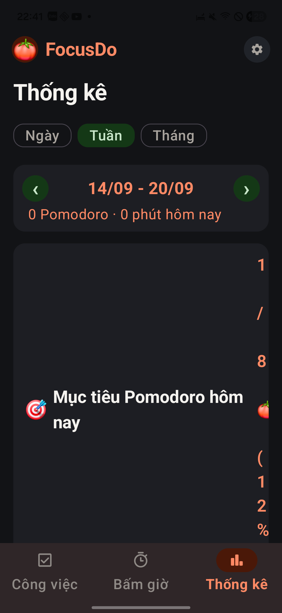
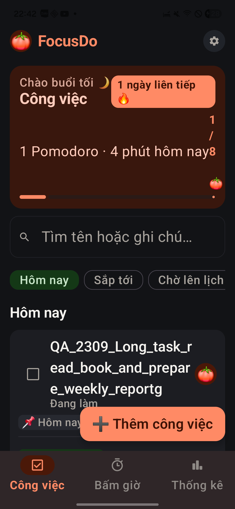
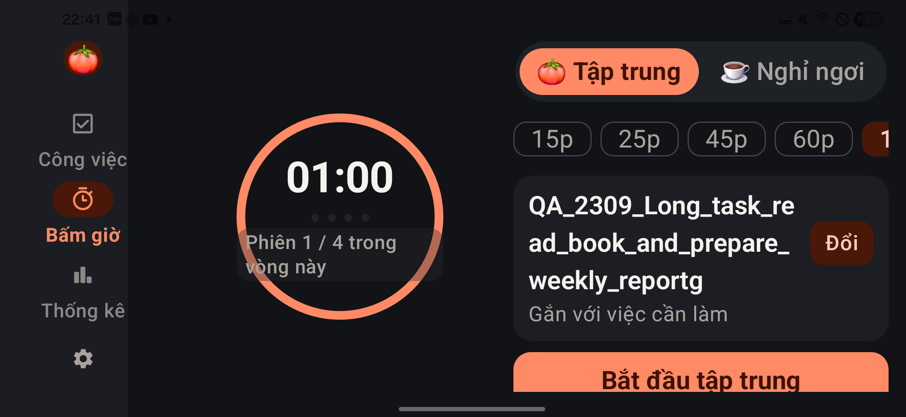
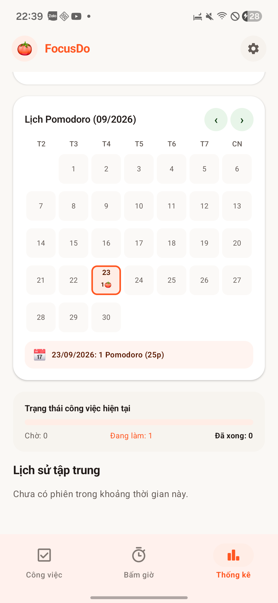
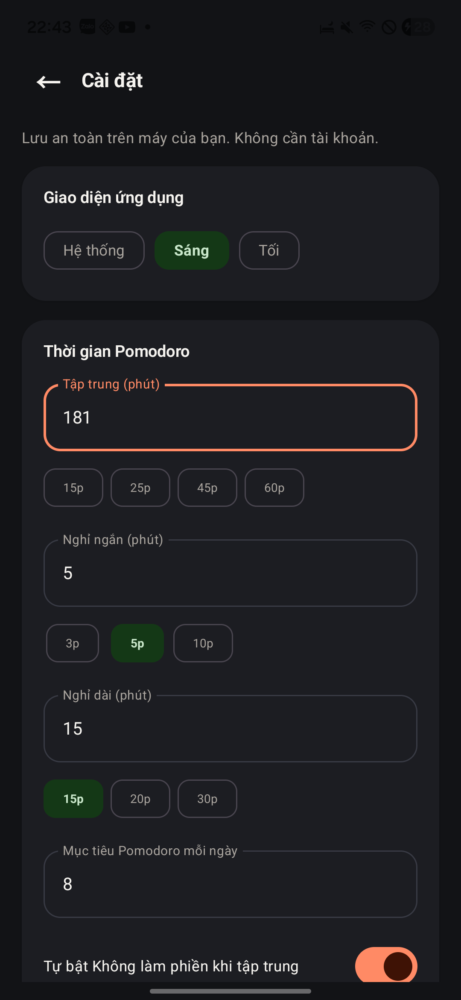

# Báo cáo kiểm thử trải nghiệm FocusDo / PodomoroApp

**Kết luận: CHƯA ĐẠT để phát hành rộng.** Luồng công việc và bấm giờ cơ bản dùng được, nhưng còn lỗi điều hướng, vỡ bố cục khi tăng chữ, số liệu thống kê sai và cài đặt hiển thị khác trạng thái thực. Phần đồng bộ có nhiều đường đi có thể làm sai hoặc trộn dữ liệu. Bộ kiểm thử Android của chính bản hiện tại không biên dịch được.

Kiểm tra trực tiếp tối **23/09/2026**, hoàn thiện báo cáo **24/09/2026**. Đây là kiểm thử khám phá trên bản làm việc hiện tại, không phải chứng nhận đã kiểm hết mọi tổ hợp thiết bị/quyền/mạng.

## 1. Bản được kiểm tra và cách thu thập bằng chứng

| Hạng mục | Thực tế |
|---|---|
| Repository | nvdung1607/PodomoroApp; remote origin đúng repository được giao |
| Nhánh / HEAD | `feature/firebase-sync` / `07567ac`, cộng các thay đổi chưa commit đã có trước khi kiểm tra |
| Thiết bị | Samsung SM-G990U3, Android API 36 |
| APK | versionName 1.0; cài trên máy từ 23/09/2026 22:29:36 |
| Xác minh bản | SHA-256 APK cài trên máy và `app-debug.apk` giống nhau: `E16DD7DCDDF431479CC6E0F02B5A210190BE99629DB7BFDBBDB11C712A98D875` |
| Màn hình | 1080 × 2340; thử dọc và ngang 2340 × 1080 |
| Chữ / theme | Cỡ chữ ban đầu 0,9×; thử 1,6×; sáng theo hệ thống và tối trong app |
| Cách thao tác | Chạm, gõ, vuốt, Back/Home qua ADB; ảnh gốc PNG và cây UI XML từ điện thoại |
| Tài khoản | Máy đã đăng nhập sẵn một tài khoản thử nghiệm. Không đăng xuất/đổi tài khoản, không tạo tài khoản mới |
| Dữ liệu thử | Công việc tiền tố `QA_2309_…`, việc con `QA_child`, một phiên dừng sớm và một phiên tự do hoàn thành 1 phút |
| Can thiệp mã nguồn | Không sửa mã ứng dụng, không commit/push, không ghi đè các thay đổi có sẵn |

**Quy ước bằng chứng:** “Tái hiện” = đã thấy trên máy; “Đo/đối chiếu” = có màu nguồn, cây UI hoặc log build; “Mã nguồn” = đường lỗi được chỉ ra từ code nhưng chưa chạy đầy đủ tình huống đó. P1 cần xử lý trước phát hành; P2 ảnh hưởng đáng kể trải nghiệm/độ tin cậy; P3 cải thiện khả năng sử dụng. Không có lỗi P0 đã được chứng minh trong đợt này.

Tổng cộng **32 phát hiện**: QA-01–QA-17 có quan sát/đo/kiểm tra build; QA-18–QA-32 là lỗi hoặc rủi ro qua mã nguồn cần kiểm chứng thêm. Một số mục là vấn đề UX, không phải crash.

## 2. Kết quả build và kiểm thử tự động

| Lệnh / kiểm tra | Kết quả thật |
|---|---|
| `./scripts/build.ps1 -JdkPath 'C:/Users/dungk/.jdks/jbr-17.0.14' -Tasks ':app:assembleDebug',':app:testDebugUnitTest',':app:lintDebug'` | BUILD SUCCESSFUL, 1m 5s |
| Unit test | Gradle báo UP-TO-DATE. XML hiện có: 24 tests, 0 failures/errors/skips: RulesTest 16, SyncTest 7, ExampleUnitTest 1. Đây là xác nhận kết quả còn hợp lệ theo Gradle, không phải 24 tests vừa được chạy lại |
| Lint | Chạy thành công, **104 warnings**, không có error. Không biến cảnh báo thư viện mới thành yêu cầu nâng dependency |
| `./scripts/build.ps1 -JdkPath 'C:/Users/dungk/.jdks/jbr-17.0.14' -Tasks ':app:assembleDebugAndroidTest'` | **FAILED** tại `compileDebugAndroidTestKotlin` |
| Instrumented tests của bản hiện tại | **BLOCKED**, chưa chạy được do lỗi biên dịch test. Không dùng APK test cũ để tuyên bố PASS |

Lỗi biên dịch thực tế:

```text
RepositoryTest.kt:27:48 No value passed for parameter 'dnd'.
RepositoryTest.kt:29:12 Argument type mismatch: actual type is 'Function0<Unit>', but 'SyncEngine?' was expected.
RepositoryTest.kt:29:26 Unresolved reference 'it'.
```

`SyncTest` chủ yếu kiểm tra chuyển object ↔ map. Nó không chứng minh đồng bộ hai máy, phân tách tài khoản, giải quyết xung đột hay bảo toàn lịch sử hoạt động đúng. Các kết quả PASS trong HANDOFF trước đây thuộc bản/tình huống trước, không thay thế kiểm tra bản này.

## 3. Lỗi đã tái hiện, đo hoặc quan sát

### QA-01 · P1 · Nút “Công việc” mở nhầm màn Bấm giờ

**Tái hiện:** từ danh sách, bấm cà chua của một công việc → sang Thống kê → bấm tab Công việc. Màn hiện ra vẫn là Bấm giờ; bấm lại tab không đưa về danh sách. Back hệ thống mới quay về công việc. Đã lặp lại sau khi trả cỡ chữ về 0,9×.

**Kỳ vọng:** tab Công việc luôn đưa tới danh sách công việc. **Tác động:** điều hướng chính mất độ tin cậy; người dùng tưởng ứng dụng bị kẹt.

**Dấu vết:** `ui/AppShell.kt:90` mở focus bằng một cách khác với điều hướng tab có `popUpTo/saveState/restoreState` tại dòng 260. Cần thống nhất back stack của đường mở từ task và đường mở bằng tab; thêm test đúng chuỗi trên, cả sau xoay màn hình.

**Bằng chứng:** `37-nav-repro.png/.xml`, `35-nav-task-fails.png`, `36-back.png`. Ảnh sau thao tác thể hiện màn sai; chuỗi thao tác được ghi trong báo cáo, không có video.

### QA-02 · P1 · Chữ lớn làm thẻ mục tiêu thống kê vỡ thành cột ký tự

**Tái hiện:** cỡ chữ 1,6× → Thống kê → cuộn lên đầu. Phần `1 / 8 🍅 (12%)` bị ép vào mép phải, xuống dòng từng ký tự; thẻ tăng chiều cao bất thường, đẩy các chỉ số xuống xa.

**Chi tiết pixel:** khối tiêu đề chiếm gần hết chiều ngang tới x=984; phần số bị ép vào cột sát mép phải. Ảnh gốc 1080 × 2340 cho thấy thẻ mục tiêu kéo dài xuống sát thanh điều hướng. Đây là lỗi bố cục, không chỉ là sở thích thẩm mỹ.

**Kỳ vọng/sửa:** chia thành hai hàng khi không đủ rộng, cho tiêu đề co giãn và số giữ nguyên cụm; bỏ giả định hai nội dung dài luôn vừa một Row. Nguồn: `ui/StatsSettingsUi.kt:166–190`.

**Bằng chứng:** `32-stats-large-top.png/.xml`.

### QA-03 · P2 · Thẻ tóm tắt Công việc cũng vỡ khi tăng chữ

**Tái hiện:** cỡ chữ 1,6× → Công việc. `1/8 🍅` trở thành cột dọc sát mép phải; dòng “1 Pomodoro · 4 phút hôm nay” chạm phần số. Huy hiệu chuỗi ngày xuống dòng emoji, thẻ đầu trang chiếm quá nhiều diện tích.

**Chi tiết đo:** XML cho phần `1/8 🍅` bounds `[961,519][990,869]`: chỉ 29 px ngang nhưng cao 350 px. **Kỳ vọng:** số tiến độ đọc trọn cụm, không tranh chỗ với câu tóm tắt. Sửa Row trong `ui/TasksUi.kt:166–185` thành bố cục thích ứng.

**Bằng chứng:** `38-task-large.png/.xml`.

### QA-04 · P2 · Nhãn chu kỳ đè lên vòng đồng hồ khi chữ lớn

**Tái hiện:** chữ 1,6×, xoay ngang, vào Bấm giờ. “Phiên 1 / 4 trong vòng này” xuống hai dòng và nền nhãn phủ qua viền tròn. Biểu tượng thông tin không còn thấy trong cây UI của trạng thái này. Nút bắt đầu ở cột bên phải chỉ xuất hiện một phần trước khi cuộn.

**Kỳ vọng:** nhãn có vùng riêng, không cắt viền đồng hồ; hành động chính dễ thấy. Cột phải có cuộn nên chưa kết luận nút không thể bấm. Nguồn: `ui/FocusUi.kt:545–643`, dial giới hạn 190dp ở ngang.

**Bằng chứng:** `29-landscape-large.png/.xml`; `28-focus-large.png` cho trường hợp dọc.

### QA-05 · P2 · Dark mode để biểu tượng hệ thống đen trên nền gần đen

**Tái hiện:** Cài đặt → Tối, trong khi hệ thống đang sáng. Đồng hồ, pin và icon thanh trạng thái gần như chìm vào nền. **Kỳ vọng:** đổi cả màu icon hệ thống theo theme app.

**Nguyên nhân phù hợp:** `MainActivity.kt` gọi `enableEdgeToEdge()` trước khi Compose áp dụng theme riêng, không thấy cập nhật system bar theo lựa chọn. **Sửa:** đồng bộ appearance của status/navigation bars với theme đang hiển thị.

**Bằng chứng:** `22-theme-welcome.png` (tên tệp là nhãn chụp; ảnh thực tế là Cài đặt tối, không phải welcome), `29-landscape-large.png`.

### QA-06 · P2 · Cam sáng không đủ tương phản cho nhiều chữ nhỏ

**Đo từ mã màu:** trắng `#FFFFFF` trên cam `#FF5722` đạt **3,16:1**; cam đó trên nền `#FAF8F5` đạt **2,98:1**. Các nhãn nhỏ như tab đang chọn và nhãn trong nút/chip cần được rà soát, không đánh đồng mọi chữ lớn với chữ nhỏ.

Dùng ngưỡng tham chiếu [W3C WCAG 1.4.3](https://www.w3.org/WAI/WCAG22/Understanding/contrast-minimum.html): 4,5:1 cho chữ thường, 3:1 cho chữ lớn. Đây là đo màu nguồn, không phải suy ra màu chính xác từ ảnh nén hay chứng nhận toàn ứng dụng đạt/không đạt WCAG.

**Kỳ vọng/sửa:** dùng sắc cam đậm hơn cho chữ/action nhỏ hoặc đổi màu chữ tương ứng; giữ sắc cam sáng cho trang trí nếu phù hợp. Nguồn: `ui/theme/Color.kt`, `Theme.kt`. Ảnh tham chiếu: `01-initial.png`, `03-editor.png`.

### QA-07 · P1 · Lịch tự tính mỗi Pomodoro thành 25 phút, số liệu sai

**Tái hiện:** Thống kê cho thấy 1 Pomodoro và tổng khoảng 4 phút; chạm 23/09 trên lịch lại hiển thị `1 Pomodoro (25p)`. Phiên có thể là 1, 15, 45, 60 phút hoặc được gia hạn; nhân 25 không có cơ sở.

**Nguyên nhân:** `ui/StatsSettingsUi.kt:639` dùng `selCount * 25`. **Kỳ vọng:** tính bằng active intervals theo ngày; phân biệt tổng focus và số phiên hoàn thành. Ngày chỉ có phiên dừng sớm cũng không nên mô tả là “Chưa có phiên tập trung” chỉ vì số Pomodoro hoàn thành bằng 0.

**Bằng chứng:** `16-stats.png`, `20-wrong-minutes.png/.xml`.

### QA-08 · P2 · Chọn tuần trước nhưng vẫn ghi “phút hôm nay”

**Tái hiện:** Thống kê → Tuần → tuần trước. Tiêu đề là `14/09 - 20/09` nhưng dòng dưới là `0 Pomodoro · 0 phút hôm nay`.

**Nguyên nhân:** tái sử dụng `today_summary` cho mọi kỳ tại `StatsSettingsUi.kt:139`; chuỗi ở `strings.xml:47`. **Sửa:** nhãn “trong kỳ”, hoặc nhãn riêng theo ngày/tuần/tháng; tránh để người dùng hiểu sai dữ liệu.

**Bằng chứng:** `17-stats-week.png`, `32-stats-large-top.png`.

### QA-09 · P2 · Biểu đồ không đi theo kỳ thống kê đang chọn

**Tái hiện:** chọn tuần 14–20/09. Lịch sử báo không có phiên trong kỳ, nhưng biểu đồ phía trên vẫn có 4p ở thứ Tư của tuần hiện tại, lịch vẫn có hoạt động ngày 23/09.

**Phân tích:** `weeklyStats` dùng `today`, không dùng `date` đang chọn (`StatsSettingsUi.kt:58,249`). Lịch có bộ chuyển tháng riêng, nên không nhất thiết phải đi theo bộ lọc chung, nhưng giao diện không phân định phạm vi rõ. Riêng biểu đồ “Thời gian theo ngày” dễ bị đọc như số liệu của kỳ đã chọn.

**Sửa:** cho biểu đồ theo bộ lọc, hoặc ghi rõ “Tuần hiện tại 21–27/09” và phân vùng các bộ lọc độc lập. **Bằng chứng:** `18-stats-chart.png`, `19-calendar.png`, `32-stats-large-top.png`.

### QA-10 · P1 · Giá trị cài đặt sai chặn cả đổi theme mà không báo lỗi

**Tái hiện:** nhập `181` vào Tập trung (phút) → không có lỗi cạnh ô → chọn Sáng. Chip Sáng được chọn nhưng toàn app vẫn tối. Sau khi chọn lại 60p hợp lệ, theme sáng mới áp dụng.

**Kỳ vọng:** đánh dấu trường không hợp lệ ngay; theme độc lập với lỗi thời lượng. **Nguyên nhân:** `applySettings()` chỉ lưu khi tất cả trường hợp lệ, trong khi state chip thay trước. `valid` được tính nhưng không dùng để thể hiện lỗi. Nguồn: `StatsSettingsUi.kt:651–675,933`.

**Bằng chứng:** `42-invalid-181.png/.xml`, `43-theme-not-applied.png`, `44-restored-duration.png`. Khi gõ nhanh cũng có lần giá trị trung gian quay về 18; cần test race nhập liệu riêng, chưa tính thành lỗi đã xác nhận độc lập.

### QA-11 · P2 · Xóa việc con mất ngay, không có Hoàn tác

**Tái hiện:** mở Chi tiết của task QA → bấm dấu ✕ cạnh việc con. Việc con biến mất ngay; không có xác nhận hoặc Snackbar Hoàn tác. Đây là dữ liệu QA tự tạo, không phải dữ liệu người dùng bị xóa.

**Kỳ vọng:** thao tác dễ bấm nhầm nên có hoàn tác, nhất là hai icon sửa/xóa đặt sát nhau. `TasksUi.kt:550` gọi delete trực tiếp; `AppViewModel.deleteChecklist()` không gửi undo như xóa task cha.

**Bằng chứng:** `07-expanded.png`, `59-child-deleted.png/.xml`.

### QA-12 · P2 · Một màn “Sửa công việc” có hai cơ chế lưu khác nhau

**Tái hiện:** thêm `QA_child` trong màn sửa → bấm Back, không bấm Lưu. Việc con vẫn xuất hiện trong danh sách. Tên/ghi chú lại là bản nháp chờ Lưu.

**Tác động:** người dùng không biết Back có hủy sửa hay không; có thể tưởng đã bỏ thay đổi việc con. **Sửa:** thống nhất toàn màn là draft + Save, hoặc ghi rõ việc con lưu ngay và cung cấp undo. Nguồn: callback checklist trong `TasksUi.kt` và `AppShell.kt:374–379`.

**Bằng chứng:** `05-child-draft.png`, `06-child-added.png/.xml`.

### QA-13 · P2 · Đang focus, bật tùy chọn DND nhưng thiếu quyền lại không cảnh báo tại chỗ

**Quan sát:** Cài đặt có tùy chọn tự bật DND và nút “Cho phép chế độ Không làm phiền”, nhưng màn focus đang chạy không có cảnh báo DND chưa hoạt động.

**Nguyên nhân:** banner chỉ nhận `config.useDnd && access.dndActive` và cảnh báo exact alarm; không có nhánh thiếu quyền DND/notification. **Kỳ vọng:** trạng thái rõ “Không làm phiền chưa bật” và hành động cấp quyền, không ép người dùng tự tìm trong Cài đặt. Nguồn: `FocusUi.kt:318,1213`.

**Bằng chứng:** `12-running.png`, `23-settings-bottom.png`. Không kết luận đã test cuộc gọi/DND thật; quyền DND chưa được cấp trong đợt này.

### QA-14 · P1 · Bộ instrumented test hiện tại không build được

`Repository` thêm `syncEngine` sau tham số hàm `dnd`; test vẫn truyền trailing lambda nên lambda bị gán vào SyncEngine. **Tác động:** mất đường kiểm chứng Room/UI/platform của bản hiện tại. **Sửa:** cập nhật lời gọi dùng `dnd = { ... }`, build lại rồi chạy tests trên đúng APK. Không sửa test trong đợt audit này.

**Bằng chứng:** log lỗi ở mục 2; `core/Repository.kt:9–15`, `androidTest/.../RepositoryTest.kt:27–29`.

### QA-15 · P2 · Nhiều nút chỉ có ký hiệu, thiếu tên hành động cho trợ năng

**Đối chiếu cây UI và code:** nút cà chua trên task chỉ có chữ `🍅`; sửa/xóa việc con là `✎`/`✕`; quay lại là `←`; chuyển kỳ là `‹`/`›`. Thiếu mô tả kiểu “Tập trung với công việc…”, “Sửa việc con…”, “Tháng trước”.

**Kỳ vọng:** đặt accessible name theo hành động, có đối tượng khi có nhiều dòng. Icon việc con được vẽ trong khung 28dp, nhưng Compose có thể mở rộng touch target; chưa dùng kích thước vẽ này để khẳng định chính xác vùng chạm chỉ 28dp. Chưa bật TalkBack và nghe thực tế.

**Bằng chứng:** `07-expanded.xml`, `21-settings.xml`, `18-stats-chart.xml`; `TasksUi.kt:357,544–555`, `AppShell.kt`, `StatsSettingsUi.kt`.

### QA-16 · P3 · “Không đặt ngày”, chọn ngày và tab Đã hoàn thành khó phát hiện

**Quan sát:** ở cỡ chữ thường, hàng ngày chỉ hiện Hôm nay/Ngày mai/Cuối tuần/Tuần sau; các lựa chọn tiếp nằm ngoài mép phải. Bộ lọc task cũng không thấy Đã hoàn thành nếu chưa vuốt ngang. Mép chip bị cắt nhưng không có chỉ dẫn/overflow rõ.

**Tác động:** người mới dễ nghĩ bắt buộc phải lên lịch hoặc không có danh sách việc đã xong. **Sửa:** đưa “Không đặt ngày”/icon lịch thành hành động rõ; bố trí các filter dễ khám phá. Đây là nhận xét UX, không phải kết luận các lựa chọn bị mất hoàn toàn.

**Bằng chứng:** `03-editor.png`, `05-child-draft.png`, `04-created.png`.

### QA-17 · P2 · Nội dung DND nói chắc hơn khả năng đã được chứng minh

**Quan sát:** cùng màn Cài đặt có câu “cho phép cuộc gọi SIM và các ứng dụng Zalo, Messenger”, rồi phía dưới lại nói cuộc gọi Zalo/Messenger cần kiểm tra riêng. Giờ nghỉ nói “Đã tắt Không làm phiền… để bạn nhận thông báo”, dù app chỉ nên nói về rule của mình, không thể bảo đảm mọi rule khác đã tắt.

**Sửa:** diễn đạt theo quyền và trạng thái thực; phân biệt rule app với chế độ toàn hệ thống; không hứa VoIP khi chưa test. Nguồn: `strings.xml:40,92`, `FocusUi.kt:311`. **Bằng chứng:** `23-settings-bottom.png`, `56-break-running.png`.

## 4. Lỗi/rủi ro phát hiện từ mã nguồn — chưa chứng minh đầy đủ trên hai máy

### QA-18 · P1 · Đồng bộ session nhưng không đồng bộ intervals

`SyncEngine` upload/listen sessions, không có đường tương đương cho `FocusInterval`. Trong khi `Statistics.report()` cộng thời gian từ intervals. **Tình huống cần test:** máy A hoàn thành 25 phút → máy B đăng nhập → B có 1 Pomodoro nhưng thiếu 25 phút focus. BackupValidator còn yêu cầu tổng intervals bằng session.activeMs, nên bản export ở máy B có thể không import lại được.

**Sửa:** đồng bộ đầy đủ lịch sử thời gian hoặc thiết kế nguồn dữ liệu báo cáo nhất quán; kiểm tra round-trip trên thiết bị nhận. Nguồn: `SyncEngine.kt:122–134,230–254`, `Rules.kt:report`, `Backup.kt:41–42`.

### QA-19 · P1 · Hoàn thành task khi chưa đăng nhập không được upload đủ lịch sử sau đăng nhập

`pushEvent()` bỏ qua khi không có user. `syncAll()` sau đó upload tasks/goals/checklists/sessions nhưng bỏ events. **Tình huống:** hoàn thành task offline khi chưa có tài khoản → đăng nhập → máy khác nhận task DONE nhưng thiếu sự kiện hoàn thành trong kỳ.

**Sửa:** upload events trong initial/manual sync, có retry và idempotency. Nguồn: `SyncEngine.kt:217–259`.

### QA-20 · P1 · Chuyển tài khoản có thể đẩy dữ liệu tài khoản trước sang tài khoản sau

Auth logout chỉ signOut; Room dùng chung, không có ownerId/phân vùng. Khi login mới, `syncAll()` upload toàn bộ Room vào UID hiện tại. **Rủi ro:** dữ liệu của A có thể bị upload lên B trên cùng điện thoại. Chưa thử đổi tài khoản thật để tránh trộn dữ liệu.

**Sửa:** tách dữ liệu theo tài khoản và xác định rõ luồng nhập dữ liệu khách, không mặc định upload toàn bộ. Nguồn: `AuthService.kt:signOut`, `SyncEngine.kt:42–47,230–254`, `Models.kt`.

### QA-21 · P1 · Initial/manual sync có thể ghi đè dữ liệu mới bằng bản cũ

`syncAll()` dùng `.set(..., merge())` vô điều kiện cho mọi task. Kiểm tra `updatedAt` chỉ có ở chiều nhận, không bảo vệ server khi upload. Listener và upload khởi động gần nhau.

**Tình huống cần test:** B offline với task cũ, A sửa task mới, B login/manual sync → bản cũ có thể lên server trước khi merge đúng. **Sửa:** quy tắc conflict có version/transaction hoặc hàng đợi mutation; test cả clock skew. Nguồn: `SyncEngine.kt:46–48,77,230–254`.

### QA-22 · P1 · Xóa việc con không được áp dụng ở máy nhận

Chiều gửi xóa document cloud; chiều nghe chỉ duyệt `snapshot.documents` và save phần còn tồn tại, không xử lý document REMOVED hay tombstone. **Hậu quả dự kiến:** máy B giữ việc con đã xóa; lần syncAll của B có thể tạo lại nó trên cloud.

**Sửa:** đồng bộ tombstone hoặc xử lý document changes REMOVED với cơ chế offline phù hợp. Nguồn: `SyncEngine.kt:105–119,191–201,247–250`.

### QA-23 · P1 · “Đã đồng bộ an toàn” chưa phản ánh xác nhận đầy đủ từ server

Các hàm push gọi Firestore `.set()`/`.delete()` mà không await hoặc gắn failure listener, nên try/catch không bắt lỗi Task bất đồng bộ. Listener tasks có thể đặt Synced, còn nhiều listener khác bỏ qua error. Trạng thái thành công không kiểm tra pending writes/fromCache hay toàn bộ tập dữ liệu.

**Kỳ vọng:** phân biệt đang chờ, lưu cục bộ, đã xác nhận server và lỗi. **Sửa:** theo dõi ACK và retry; không để một collection thành công che lỗi collection khác. Nguồn: `SyncEngine.kt:80,88,107,123,138,152–226`.

### QA-24 · P1 · Restore thay thế Room nhưng cloud có thể đưa dữ liệu cũ trở lại

`BackupService.restore()` xóa/thay dữ liệu local trong transaction, nhưng SyncEngine listener vẫn hoạt động; chưa thấy quy trình điều phối restore với trạng thái cloud. **Tình huống cần test:** khôi phục backup cũ khi đang đăng nhập; remote vẫn giữ item không có trong backup; reconnect/listener có thể đưa chúng về.

**Sửa:** chốt semantics restore khi có cloud, tạm dừng sync và dùng một cơ chế thay thế/version nhất quán. Không tuyên bố local transaction giải quyết được tính atomic giữa local và cloud. Nguồn: `Backup.kt:restore`, `SyncEngine.kt:attachListeners`.

### QA-25 · P2 · Đổi cài đặt làm mất lựa chọn “không hỏi đăng nhập lại”

`applySettings()` tạo `AppSettings(fVal, sVal, lVal, tVal, dnd, th)`, bỏ trường `skipAuthPrompt`, nên trường đó trở về mặc định false và được lưu. **Tình huống:** khách chọn nhớ dùng ngoại tuyến → thay theme/thời lượng trong Cài đặt → welcome có thể xuất hiện lại.

**Sửa:** dùng `config.copy(...)` giữ các trường không sửa. Nguồn: `StatsSettingsUi.kt:675`, `Models.kt:AppSettings`, `SettingsStore.kt:save`. Máy thử đang đăng nhập nên chưa tái hiện nhánh khách này.

### QA-26 · P2 · Hết giờ nghỉ có thể gửi thông báo “hoàn thành tập trung”

`finish()` luôn chuyển phase về FOCUS, rồi `reconcile()`/`pause()`/`stop()` dùng phase của state sau chuyển để gọi `scheduler.completed(...)`. Với pha BREAK vừa kết thúc, cờ focus sẽ thành true. Scheduler chọn title/hint theo cờ đó.

**Sửa:** giữ phase trước chuyển trạng thái khi phát sự kiện hoàn thành. **Test:** nghỉ 1 phút hết tự nhiên và bấm pause/stop đúng biên hết giờ; phải hiện thông báo kết thúc nghỉ, không cộng Pomodoro. Đã thấy pha nghỉ quay về idle trên máy, nhưng không thu được thông báo đúng khoảnh khắc nên phần nội dung thông báo ở đây là kết luận từ code. Nguồn: `Repository.kt:202–214,228,249,264`, `Platform.kt:227–284`.

### QA-27 · P1 · Gia hạn vượt 180 phút tạo dữ liệu mà backup không chấp nhận

`extendCurrentTimer()` cộng thêm thời lượng không có giới hạn trên; `BackupCodec.validate()` chỉ cho `plannedMs <= 10.800.000` (180 phút). **Tái hiện đề xuất:** bắt đầu 180p → +5p → kết thúc sớm → export → import file vừa export. Validator sẽ từ chối plannedMs 185p dù chính app tạo ra.

**Sửa:** thống nhất giới hạn dữ liệu giữa timer và backup, hoặc giới hạn gia hạn rõ trên UI. Không cần chờ đủ 185 phút để test trường hợp này. Nguồn: `Repository.kt:160–190`, `Backup.kt:38`.

### QA-28 · P2 · Dialog đăng nhập/đăng ký không cuộn khi bàn phím/chữ lớn

AuthDialog là Column cố định với nhiều thành phần, không có verticalScroll hay chiến lược thu gọn. Đăng ký thêm ô xác nhận và lỗi làm tăng chiều cao. **Rủi ro:** nút submit/để sau bị cắt ở ngang, màn thấp hoặc chữ lớn.

**Sửa:** vùng form cuộn, xử lý IME, hành động luôn truy cập được; kiểm thử 1,6×/2× và bàn phím mở. Không logout tài khoản hiện có để chạy nhánh này. Nguồn: `ui/AuthDialog.kt:Dialog/Column` và `WelcomeAuthDialog.kt`.

### QA-29 · P2 · Có đăng nhập mật khẩu nhưng không có đường “Quên mật khẩu”

UI và AuthService hiện chỉ có login/register/signOut. **Tác động:** người dùng quên mật khẩu không có luồng tự phục hồi ngay trong sản phẩm. Đây là thiếu sót UX chức năng, không phải lỗi mật khẩu đã bị mất.

**Sửa:** thêm reset password và trạng thái thành công/lỗi phù hợp; chưa gửi email thử trong đợt audit. Nguồn: `AuthDialog.kt`, `AuthService.kt`.

### QA-30 · P2 · Lưu task đóng editor trước khi biết dữ liệu đã lưu thành công

`AppShell.kt:375` gọi `model.saveTask(it)` rồi xóa `editTask` ngay. ViewModel chạy coroutine và chỉ phát một thông báo lỗi chung nếu thất bại. **Rủi ro:** lỗi lưu làm mất bản nháp trên màn hình; người dùng phải nhập lại, không có retry giữ dữ liệu.

**Sửa:** chỉ đóng khi repository xác nhận thành công; giữ draft và hiện lỗi theo trường/tình huống. Kịch bản disk-full/DAO failure chưa được inject thử. Không coi mọi lần lưu hiện tại đều lỗi.

### QA-31 · P2 · Chu kỳ tự reset qua ngày/3 giờ khác với PRD

`TimerRules.shouldResetCycle()` trả true nếu qua ngày hoặc cách phiên trước hơn 3 giờ; `Repository.startFocus()` áp dụng điều đó. PRD ghi bộ đếm không reset khi qua ngày. Đây là **xung đột yêu cầu cần quyết định**, vì nhánh hiện tại đã có nhiều thay đổi sau baseline, không tự khẳng định lựa chọn mới của sản phẩm là sai.

**Test sau khi chốt:** hoàn thành 3 phiên trước nửa đêm, chạy phiên thứ 4 sau nửa đêm; kết quả nghỉ dài phải đúng chính sách đã thống nhất. Nguồn: `Rules.kt:shouldResetCycle`, `Repository.kt:135–136`.

### QA-32 · P2 · Mốc “hôm nay” trong thống kê có thể cũ sau nửa đêm

`StatsScreen` giữ `today` bằng `remember { LocalDate.now() }`; dateText/selectedCalendarMonth cũng khởi tạo rồi giữ lại. App không có nguồn ngày thay đổi được observe rõ ràng. **Rủi ro:** giữ màn qua nửa đêm hoặc resume mà composition còn sống, mục tiêu ngày/streak/biểu đồ vẫn theo hôm qua.

**Sửa:** đưa ngày/múi giờ hiện tại thành state từ clock, cập nhật ở biên ngày và resume; test với clock inject. Chưa đổi giờ hệ thống hay chờ qua nửa đêm trên máy để xác nhận. Nguồn: `StatsSettingsUi.kt:48–64`.

## 5. Ma trận chức năng — đã làm gì và còn thiếu gì

| Chức năng / nút | Đã kiểm tra thực tế | Kết luận / giới hạn |
|---|---|---|
| 3 tab, Cài đặt, Back | Đã chạm và chuyển nhiều lần | Có lỗi QA-01; mở Cài đặt và Back dùng được ở luồng thường |
| Thêm task chỉ có tên dài | Nhập tên QA dài, Lưu, mở lại editor | Lưu và hiển thị được; chưa test tiếng Việt có dấu bằng nhập liệu mới trong đợt này |
| Tên rỗng | Đọc validation và test cũ | Chưa tự thao tác đủ trắng/tab/newline; không tuyên bố device PASS |
| Sửa task, ghi chú, ưu tiên | Mở editor và kiểm bố cục | Chưa hoàn tất mọi tổ hợp lưu, ngày/ưu tiên/note |
| Ngày dự định/hạn chót/date picker | Quan sát chip, cuộn editor | Chưa thử đầy đủ ngày quá hạn, picker, cuối tuần, không ngày |
| Hôm nay/Sắp tới/Inbox/Tất cả/Đã xong, tìm kiếm | Đọc bộ lọc, quan sát vị trí | Chưa chạy đủ ma trận dữ liệu cho mọi filter/query; cần vòng regression riêng |
| Hoàn thành / mở lại | Tick task QA rồi mở lại | Trạng thái đổi đúng ở chuỗi này; thống kê ghi nhận việc xong dù task được mở lại |
| Xóa task cha / Hoàn tác | Đọc code và tests | Chưa chạy UI chuỗi này trong đợt hiện tại |
| Thêm/tick/expand việc con | Đã chạy | Dùng được; phát hiện cơ chế lưu không đồng nhất |
| Sửa/xóa việc con | Mở dialog, nhập sửa, bấm Lưu rồi xóa | Xóa hoạt động nhưng không undo; chưa chụp riêng hậu trạng thái tên sửa |
| Chọn task / chuyển focus tự do | Đã chọn task QA rồi đổi sang tự do | Dùng được; đường từ task gây lỗi back stack |
| Focus Tùy chỉnh | Đổi 60 → 1 phút và lưu | Dùng được; chưa bấm từng preset 15/25/45 và mọi giá trị biên |
| Start/Pause/Resume/+1/+5/Stop | Đã thao tác trên phiên QA | Pause 00:48; +1 thành 01:48; +5, Resume và kết thúc sớm chạy được |
| Hoàn thành focus | Chờ đủ một phiên tự do 1 phút | Có màn chúc mừng và báo đang đổ chuông; chưa nghe âm thanh thực tế |
| Tắt chuông | Bấm trên banner | Banner mất; không khẳng định đo âm lượng/độ trễ |
| Đề nghị nghỉ / tùy chỉnh nghỉ / start nghỉ | Đặt nghỉ 1 phút, bắt đầu, chờ quay về idle | Nghỉ không làm số Pomodoro tăng trong quan sát; chưa kiểm mọi nút pause/+1/skip của nghỉ |
| Reset chu kỳ, 4 phiên → nghỉ dài | Đọc logic/test | Chưa chạy 4 phiên thật và nút reset; instrumented test bị chặn |
| Home / quay lại | Home trong phiên 1 phút rồi mở lại | Countdown tiếp tục; không phải bằng chứng Doze/process death |
| Process death | Thử `am kill` sau Home | PID vẫn còn 8428; **không tạo được process death**, không tuyên bố PASS |
| Recent/force-stop/reboot/Doze | Chưa chạy | VERIFY_DEVICE; không suy ra từ Home/Back |
| DND/quyền/chuông cuộc gọi/VoIP | Quan sát UI quyền, đọc code | Chưa cấp/thu hồi quyền, chưa gọi thật; VERIFY_DEVICE |
| Thống kê ngày/tuần/tuần trước/lịch | Đã chạm, cuộn, chọn ngày | QA-07/08/09 tái hiện; chưa kiểm tháng/quý, DST, đổi múi giờ trên máy |
| Cài đặt theme, số phút | Đổi Tối/Sáng/Hệ thống, nhập 181 | QA-05/10 tái hiện; mục tiêu ngày và mọi preset chưa thử hết |
| Backup export | Chọn xuất, lưu bằng document picker | Có thông báo thành công và tệp 1.995 bytes trên máy |
| Restore/backup trước restore | Đọc codec/service/tests | Không thay thế dữ liệu hiện có; round-trip/invalid-file UI chưa chạy, tests bị chặn |
| Login/register/logout/manual sync | Quan sát tài khoản đã login, đọc code | Không thao tác đổi tài khoản, không gửi email, chưa chạy hai máy/offline conflict |
| Chữ lớn/dark/landscape/keyboard | Đã chạy các màn chính và editor nhập liệu | Có ảnh lỗi; chưa đủ 2×, màn nhỏ/API24/TalkBack |

**Không thể nói “đã kiểm hết từng nút”.** Bảng trên chỉ rõ các nút đã bấm và phần chưa có bằng chứng. Một thiết bị, một tài khoản đang đăng nhập và bộ test đang lỗi chưa đủ để chứng minh mọi tổ hợp đều ổn.

## 6. Những điểm đang hoạt động và nhận xét thẩm mỹ

Tạo task không cần timer; hoàn thành/mở lại độc lập; tạo/tick việc con; liên kết task với focus; tạm dừng/gia hạn/kết thúc sớm; phiên tự do hoàn thành và đề nghị nghỉ đều đã có hành vi dùng được. Nút kết thúc sớm đã được tách hàng, dễ đọc ở cỡ chữ thường. Các thẻ có khoảng cách và bo góc tương đối nhất quán ở cấu hình ban đầu.

Các điểm cần trau chuốt ngoài lỗi nghiêm trọng: dùng lẫn emoji và vector làm trọng lượng thị giác thiếu đồng đều; “Bấm giờ”/“Tập trung” cần thống nhất ý nghĩa; “0đ”, “Firebase”, “an toàn” lặp trong màn tài khoản mang tính kỹ thuật/quảng cáo hơn là giúp người dùng biết dữ liệu đã lên server chưa. Khi chỉ có một task, phần đầu trang và bộ lọc chiếm nhiều diện tích trước khi thấy nội dung chính. Đây là nhận xét thiết kế, không gắn nhãn crash hay mất dữ liệu.

## 7. Thứ tự sửa và tiêu chí kiểm lại

1. **Bảo toàn dữ liệu:** QA-18–24, QA-27. Test hai thiết bị với account riêng, offline/reconnect, xóa checklist, xung đột cập nhật, restore khi có cloud. Chưa cho phép khẳng định đồng bộ an toàn trước khi qua các ca này.
2. **Khôi phục kiểm thử:** QA-14. Build được test APK mới, chạy Repository/UI/platform và phân biệt skip với pass.
3. **Sửa luồng phổ thông:** QA-01, QA-07, QA-10. Tab luôn mở đúng; lịch đúng phút; cài đặt không hiển thị trạng thái giả.
4. **UI/accessibility:** QA-02–06, QA-15/16/28. Screenshot dọc/ngang ở 0,9×, 1,0×, 1,6× và 2×; kiểm chữ dài, IME và accessible names. Không chỉ assert nút “exists”.
5. **UX tin cậy:** QA-08/09/11/12/13/17/25/26/29/30; chốt lại chính sách chu kỳ và ngày ở QA-31/32.

## 8. Bằng chứng hình ảnh tiêu biểu

### Thẻ thống kê vỡ ở chữ 1,6×



### Tóm tắt Công việc bị vỡ ở chữ 1,6×



### Xoay ngang: nhãn phủ vòng đồng hồ



### Lịch ghi sai 25 phút



### Chọn Sáng nhưng app vẫn tối khi ô phút là 181



Các ảnh gốc không được dựng lại hoặc chỉnh nội dung. Phần lớn có XML cùng tên để đối chiếu text/bounds. Tên một số tệp phản ánh dự định lúc chụp; mô tả trong báo cáo căn cứ nội dung thật, không căn cứ tên tệp.

## 9. Trạng thái bàn giao sau kiểm thử

- Đã trả font_scale về **0,9**, user_rotation về **0** (dọc), accelerometer_rotation giữ **0** như ban đầu; theme **Hệ thống**, focus **60 phút**. Nghỉ ngắn/dài và mục tiêu ngày không chủ động thay đổi.
- Phiên kiểm thử đã kết thúc; ảnh `62-restored.png` là trạng thái sẵn sàng 60:00, không còn timer chạy.
- Giữ task QA và lịch sử phiên QA để đối chiếu, không xóa sự kiện thống kê của người dùng. Việc con QA đã xóa trong ca kiểm thử xóa. Dữ liệu QA có thể được app đồng bộ vì tài khoản đang đăng nhập; không chạy thử tài khoản khác.
- Tệp backup test đã lưu trong Download với tên `podomoro-2026-09-23.json`; chưa restore lên dữ liệu thật. Export không bao gồm cài đặt theo thiết kế hiện tại.
- Tệp mới của đợt audit nằm trong `output/qa-2026-09-23/`; không sửa docs backlog/handoff để biến kết quả cũ thành kết quả mới; không sửa mã nguồn ứng dụng.
- Trạng thái kiểm thử còn lại: **VERIFY_DEVICE** cho hệ điều hành cũ, Doze/chuông/DND/VoIP/reboot/force-stop; **BLOCKED** cho instrumented tests hiện tại; **chưa kiểm chứng end-to-end** cho đồng bộ nhiều máy và restore cùng cloud.
